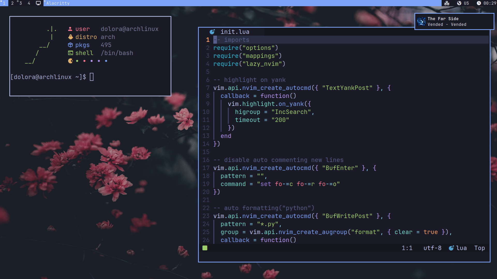

# My workspace setup

<table align="center">
    <thead>
        <tr>
            <th>Name</th>
            <th>Detail</th>
        </tr>
    </thead>
    <tbody>
        <tr>
            <td>Distro</td>
            <td><a href="https://archlinux.org/">arch</a></td>
        </tr>
        <tr>
            <td>WM</td>
            <td><a href="https://dwm.suckless.org/">dwm<a/></td>
        </tr>
        <tr>
            <td>Bar</td>
            <td><a href="https://github.com/torrinfail/dwmblocks">dwmblocks</a></td>
        </tr>
        <tr>
            <td>Terminal</td>
            <td><a href="https://alacritty.org/">alacritty</a></td>
        </tr>
        <tr>
            <td>App launcher</td>
            <td><a href="https://tools.suckless.org/dmenu/">dmenu</a></td>
        </tr>
        <tr>
            <td>Notify</td>
            <td><a href="https://github.com/dunst-project/dunst">dunst</a></td>
        </tr>
        <tr>
            <td>Explorer</td>
            <td><a href="https://github.com/ranger/ranger">ranger</a></td>
        </tr>
    </tbody>
</table>

 
 

  
   

